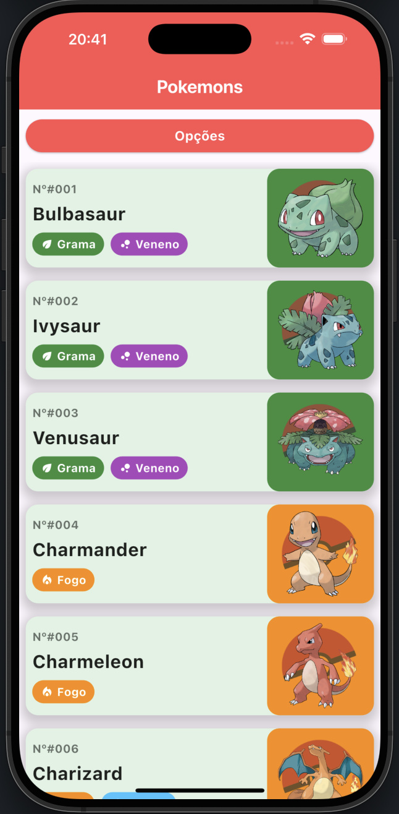
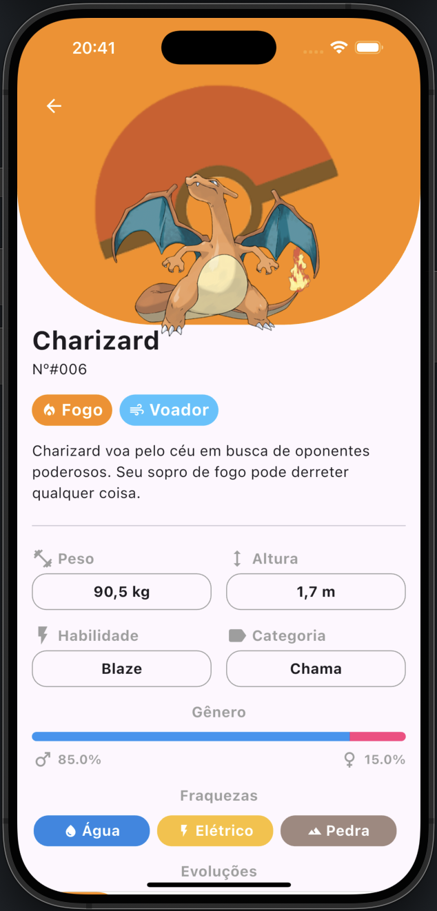
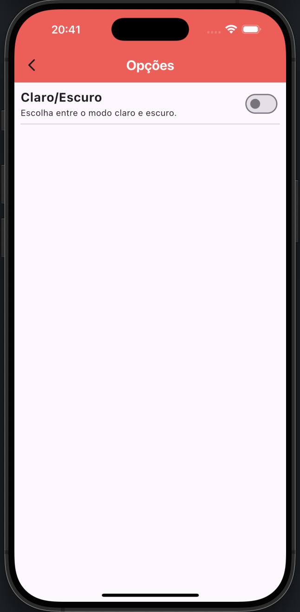

# 🧩 PokeFlutt

PokeFlutt é um aplicativo Flutter de Pokédex, com design moderno e recursos que permitem explorar detalhes dos Pokémons, incluindo tipo, fraquezas, evoluções, gênero, entre outros.

## 📱 Funcionalidades

- Listagem de Pokémons com número, nome e tipo.
- Tela de detalhes com:
  - Imagem do Pokémon.
  - Tipos e fraquezas.
  - Evoluções.
  - Gênero.
- Suporte ao tema claro e escuro.
- UI responsiva e intuitiva.

## 🖼️ Screenshots

| Tela Inicial | Detalhes do Pokémon | Tema Claro e Escuro |
|--------------|---------------------|----------------------|
|  |  |  |

> 📌 Coloque suas capturas de tela em `assets/screenshots/` e ajuste os nomes se necessário.

## 🚀 Instalação

```bash
git clone https://github.com/seu-usuario/pokeflutt.git
cd pokeflutt
flutter pub get
flutter run
